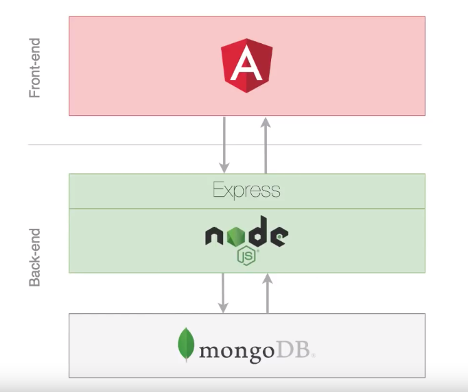

# Phonebook App (MEAN Stack application)
In this repository you can find a small example of a MEAN stack application.
The project is about a simple phonebook agenda to deploy a list of contacts. The user will be available to create new contacts, edit a previous contact or delete an specific one.


## Table of Contents

* [Prerequisites](#prerequisites)
* [Installation](#installation)
* [Project](#project)
* [Testing](#testing)
* [License](#license)

## Prerequisites


The following info is to set the minimun installations to deploy properly the application. In case you already deal with this kind of situations feel free to go to the following point.

· The project have dependencies that require Node 8.9.4 or higher with npm 5.5.1 or higher.
· Angular 7 or 8 (more oriented for best practices with routing and components).
· MongoDB
· You will need a code editor, in my case I use Visual Studio Code.

## Installation

**BEFORE YOU INSTALL:** please read the [prerequisites](#prerequisites)

Before to dowload the project you must execute the following commands to set the minimal configuration to your equip:

### Node installation
```bash
go to the nodejs https://nodejs.org/en/ website and install the stable version.
```

### Angular installation
After the NodeJS installation, execute the following command from a terminal.
```bash
npm install -g @angular/cli
```

### TypeScript installation (recomended)
```bash
npm install -g typescript
```

### MongoDB installation (recomended)
```bash
go to the website and following the instructions for:
for Windows: https://docs.mongodb.com/manual/tutorial/install-mongodb-on-windows/
for Mac: https://docs.mongodb.com/manual/tutorial/install-mongodb-on-os-x/
```


## Project

Before to download the project I just add this image I found in internet that perfectly suits the architecture of this simple project



Ok, now after download the project from the repository, execute the following commands:

```bash
.../phonebook>
    npm install
```

due the mongoDB and babel extensions (compiler to use ES6) execute the following commands to set a proper configuration
```bash
.../backend>
    npm install --save-dev @babel/core @babel/cli @babel/preset-env @babel/node
```

launch mongodb to have access to the data base
```bash
.../backend>
    mongod
```

from a diferent terminal launch the following command
```bash
.../backend>
    npm run dev
```

from a diferent terminal launch the following command
```bash
.../phonebook>
    ng serve -o
```

Now you can test the app on your browser!!!

## Testing

To test the application I use some applications as Postman, or the terminal for some simple test on the data base.
I just put some images to show some tips, for a proper testing I recomend not on ly test about communication between backend and frontend, is recomended to test some basic queries, configurations, test the server, and individual test on the frontend with a final e2e test.

###### MongoDB:


###### Front-end / Backend:


###### Postman:

###### Get all contacts


###### Create a new contact


###### Update a previous contact


###### Delete an specific contact


###### Regular Expresion:
This  is a testing online for regular expressions https://www.regextester.com/


## License

GNU General Public License v3.0

